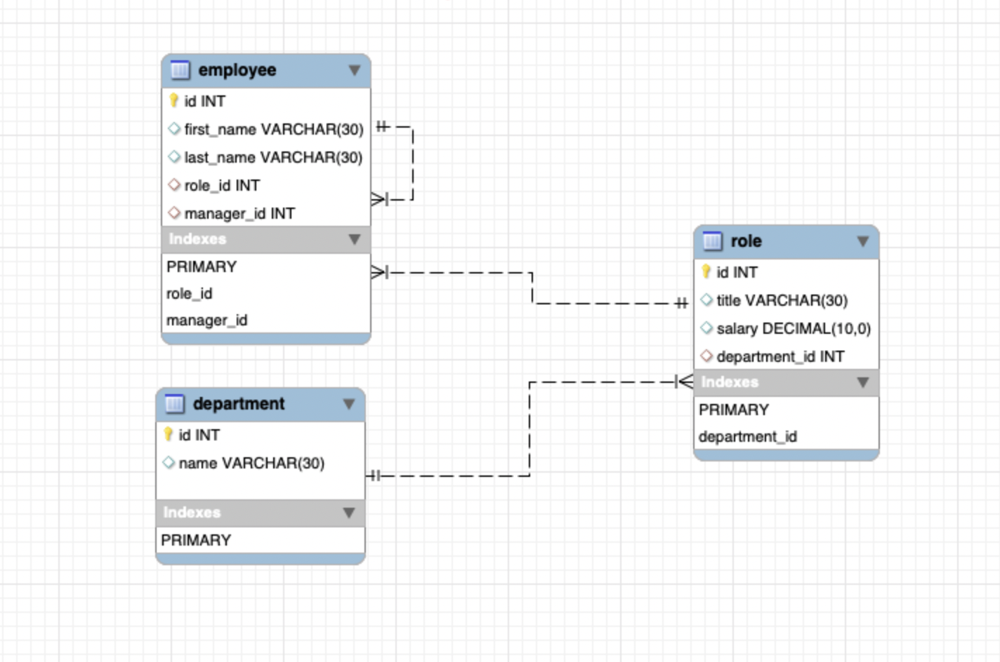

# employee_tracker

##### Installation

Code:`git@github.com:Nahid1010/employee_tracker.git`
You can clone code from github link and run it locally on your computer.

##### Prerequisites
A computer with `mysql` database installed locally, `node.js` and `npm` (node package manager). It uses `inquirer`, `mysql`, `dotenv` node packages. To clone code from github, you need to have aceess to the Internet. Also your computer should have Terminal (Unix) software installed.

##### Installing and running
* Open a terminal.
* Create a directory for this project.
* Change current directory to this project direcory.
* Issue the following command - `git@github.com:Nahid1010/employee_tracker.git`
* If you don't have `node.js` installed already then download it, and follow the instructions to install it.
* Once installed, use `npm` to install `inquirer`, `mysql`, `dotenv` package by issuing `npm i <package>` command at the terminal prompt (where `<package>` is one of `inquirer`, `mysql`, `dotenv`).
* After that you need to create a database and tables using the file `assets/schema.sql`. Following image shows the design of the databse and relations between the tables-
